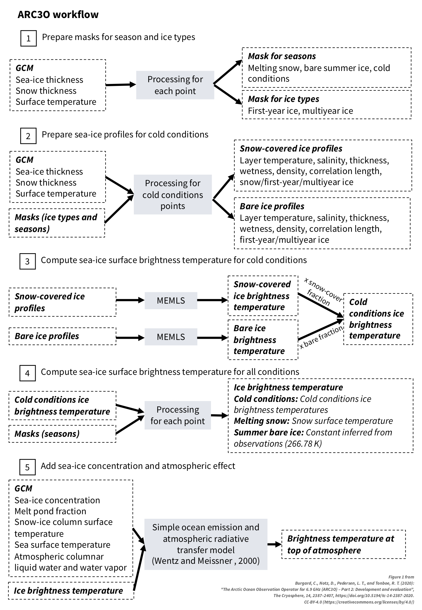

Workflow overview
=================

General workflow
----------------

ARC3O simulates brightness temperatures from climate model output. It follows the following workflow.

.. note:: 
	
	Please remain aware that the assumptions used in ARC3O have only been evaluated for the frequency of 6.9 GHz,
	vertical polarization at the moment! The use for other frequencies and polarizations is at your own risk!
	

.. _`Burgard et al., 2020b`: https://tc.copernicus.org/articles/14/2387/2020/

.. include:: ./step1.rst
.. include:: ./step2.rst
.. include:: ./step3.rst
.. include:: ./step4.rst
.. include:: ./step5.rst